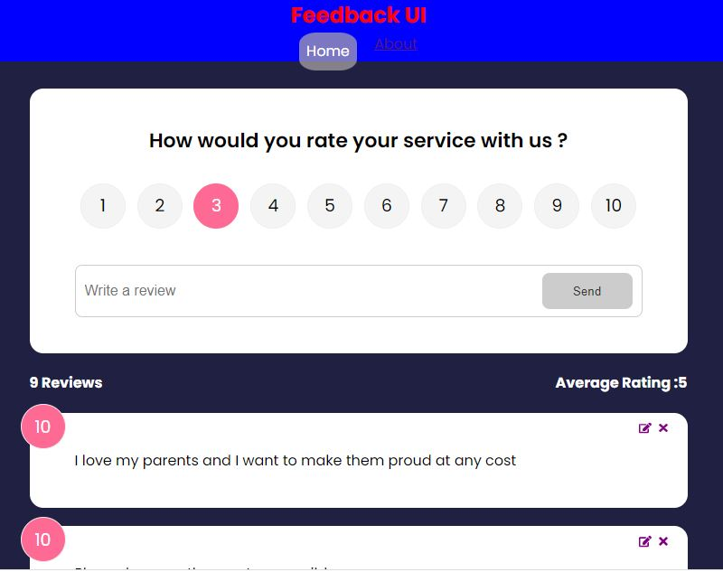

 # FeedbackUI App
 It is a simple app in which we can provide our feedback and rating and it will be stored in the database. In this application I used JSON Server which is a simple backend extension in the npm library. Here I used concurrently which is used for requesting data from the backend and provide it to front end.
          There are many React features which are also used in this app such as Coditional Rendering, Axios etc, so as to enhance the functionality of App. The image has been provided below:  

  

We can also edit and delete the feedback with the help of buttons provided on the right side of App. Beside this, total reviews and average 
rating has also been calculated on the basis of feedback provided.  
